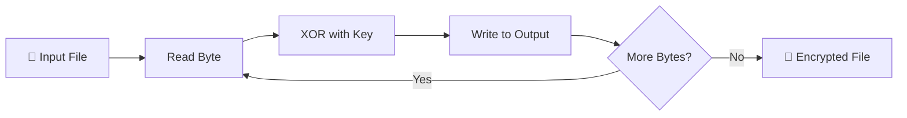

# 🔐 SafeBox - File Encryptor/Decryptor

<div align="center">


**A lightweight command-line file encryption tool built with modern C++**

[Features](#-features) • [Installation](#-installation) • [Usage](#-usage) • [How It Works](#-how-it-works) • [Learning Journey](#-learning-journey)

</div>

---

## 📖 About The Project

**SafeBox** is a command-line file encryption/decryption tool that uses the **XOR cipher algorithm** to secure your files. This project was built as part of my journey to master C++ programming, focusing on file I/O operations, binary data manipulation, and secure coding practices.

> ⚠️ **Disclaimer**: This tool is built for educational purposes. For production-grade security, consider using established encryption libraries like OpenSSL or libsodium.

---

## ✨ Features

| Feature | Description |
|---------|-------------|
| 🔒 **File Encryption** | Encrypt any file type using XOR cipher with a custom key |
| 🔓 **File Decryption** | Decrypt encrypted files using the same key |
| 🗑️ **Secure Shred** | Optionally delete the original file after encryption |
| 📁 **Binary Mode** | Works with all file types (text, images, documents, etc.) |
| 💻 **CLI Interface** | Simple and intuitive command-line interface |
| 🎯 **Cross-Platform** | Works on Windows, Linux, and macOS |

---

## 🚀 Installation

### Prerequisites

- C++ Compiler (GCC, Clang, or MSVC)
- C++11 or later

### Build Instructions

```bash
# Clone the repository
git clone https://github.com/yourusername/SafeBox.git
cd SafeBox

# Compile using g++
g++ -o safebox main.cpp Encryptor.cpp -std=c++11

# Or using MSVC (Windows)
cl /EHsc main.cpp Encryptor.cpp /Fe:safebox.exe
```

---

## 📋 Usage

### Basic Syntax

```bash
./safebox <mode> <filename> <key> [options]
```

### Modes

| Mode | Description |
|------|-------------|
| `-e` | Encrypt the file |
| `-d` | Decrypt the file |

### Options

| Option | Description |
|--------|-------------|
| `--shred` | Delete the original file after encryption (with confirmation) |

### Examples

```bash
# 🔐 Encrypt a file
./safebox -e secret.txt MySecretKey123

# 🔓 Decrypt a file
./safebox -d secret.txt.enc MySecretKey123

# 🗑️ Encrypt and shred original file
./safebox -e confidential.pdf SuperSecretKey --shred
```

### Output

```
==========================================================
                  SAFEBOX FILE ENCRYPTOR          
==========================================================

Usage: \.safebox <mode> <filename> <key> [options]
Modes: 
  -e : Encrypt the file
  -d : Decrypt the file
Options: 
  --shred : Delete the original file after encryption
Example: 
  .\safebox -e myfile.txt K
Remember your key! Without it, decryption is not possible.
```

---

## 🔧 How It Works

### XOR Cipher Algorithm

SafeBox uses the **XOR (Exclusive OR)** cipher, a symmetric encryption technique:

```
Encrypted = Original XOR Key
Original = Encrypted XOR Key
```

### Encryption Process



### Key Features of Implementation

1. **Binary File Handling**: Uses `ios::binary` flag for raw byte operations
2. **Cyclic Key Application**: Key repeats cyclically for files larger than key length
3. **Memory Efficient**: Processes file byte-by-byte, suitable for large files
4. **Error Handling**: Comprehensive validation for file operations and user input

---

## 📁 Project Structure

```
SafeBox/
├── 📄 main.cpp           # Entry point and CLI handling
├── 📄 Encryptor.cpp      # Core encryption/decryption logic
├── 📄 Encryptor.h        # Encryptor class header
├── 📄 README.md          # Project documentation
└── 🔒 test.txt.enc       # Sample encrypted file
```

---

## 🎓 Learning Journey

### Concepts Mastered

| Concept | Description |
|---------|-------------|
| 📚 **File I/O** | Binary file reading/writing with `ifstream` and `ofstream` |
| 🔤 **String Manipulation** | Substring extraction, string finding operations |
| 🎛️ **Command Line Args** | Parsing `argc` and `argv` for CLI applications |
| 🏗️ **OOP Principles** | Class design with separate header and implementation files |
| ⚠️ **Error Handling** | Input validation and graceful error messages |
| 🔢 **Bitwise Operations** | XOR operation for encryption |
| 📦 **Modular Code** | Separation of concerns with reusable components |

### Skills Developed

- ✅ Working with binary data in C++
- ✅ Building command-line applications
- ✅ Understanding symmetric encryption basics
- ✅ File system operations (read, write, delete)
- ✅ Memory-efficient stream processing
- ✅ Clean code organization and documentation

---

## 🔮 Future Improvements

- [ ] 🔑 **Stronger Encryption**: Implement AES-256 encryption using OpenSSL
- [ ] 🔒 **Password Hashing**: Add key derivation function (PBKDF2/Argon2)
- [ ] 📊 **Progress Bar**: Show encryption progress for large files
- [ ] 📁 **Directory Support**: Encrypt entire directories recursively
- [ ] 🗜️ **Compression**: Add file compression before encryption
- [ ] 🔐 **Key File Support**: Use key files instead of command-line keys
- [ ] 🧪 **Unit Tests**: Add comprehensive test suite
- [ ] 📝 **Logging**: Add detailed logging for debugging
- [ ] 🖥️ **GUI Version**: Create a graphical user interface
- [ ] 🔄 **Parallel Processing**: Multi-threaded encryption for faster processing

---

## ⚠️ Security Considerations

> **Important**: XOR cipher alone is NOT cryptographically secure for protecting sensitive data.

### Known Limitations

1. **Key Vulnerability**: Key can be recovered through known-plaintext attacks
2. **No Authentication**: Doesn't verify file integrity
3. **Key Repetition**: Short keys create patterns in encrypted data

### Recommendations for Production Use

- Use established libraries (OpenSSL, libsodium)
- Implement proper key derivation functions
- Add message authentication codes (MAC)
- Never hardcode keys in source code

---

## 🤝 Contributing

Contributions are welcome! Here's how you can help:

1. 🍴 Fork the repository
2. 🌿 Create a feature branch (`git checkout -b feature/AmazingFeature`)
3. 💾 Commit your changes (`git commit -m 'Add some AmazingFeature'`)
4. 📤 Push to the branch (`git push origin feature/AmazingFeature`)
5. 🔃 Open a Pull Request

---

## 📜 License

This project is licensed under the MIT License - see the [LICENSE](LICENSE) file for details.

---

## 👤 Author

<div align="center">

**Your Name**

[](https://github.com/yourusername)
[](https://linkedin.com/in/yourusername)
[](https://twitter.com/yourusername)

*A passionate developer learning C++ and building cool projects!*

</div>

---

## 🙏 Acknowledgments

- 📚 [C++ Reference](https://en.cppreference.com/) - For comprehensive documentation
- 💡 [GeeksforGeeks](https://www.geeksforgeeks.org/) - For algorithm explanations
- 🎓 Stack Overflow Community - For troubleshooting help
- 📖 "The C++ Programming Language" by Bjarne Stroustrup

---

<div align="center">

⭐ **If you found this project helpful, please give it a star!** ⭐

Made with ❤️ and lots of ☕


</div>
